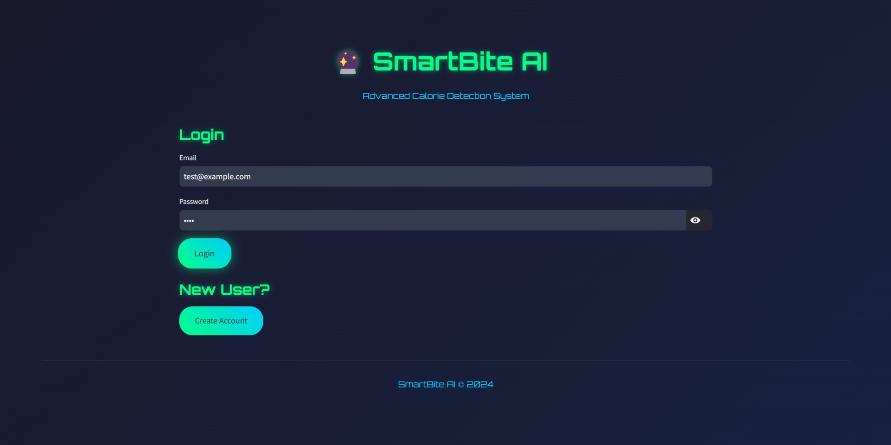
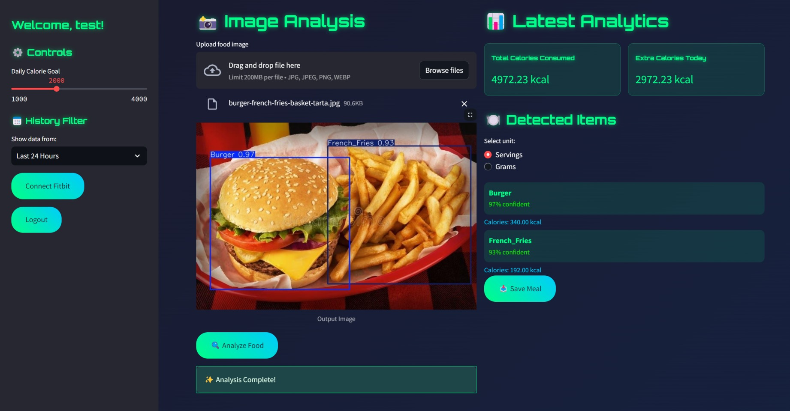
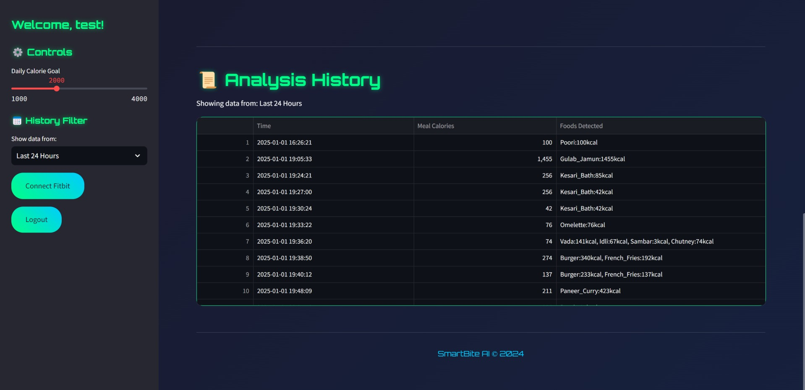
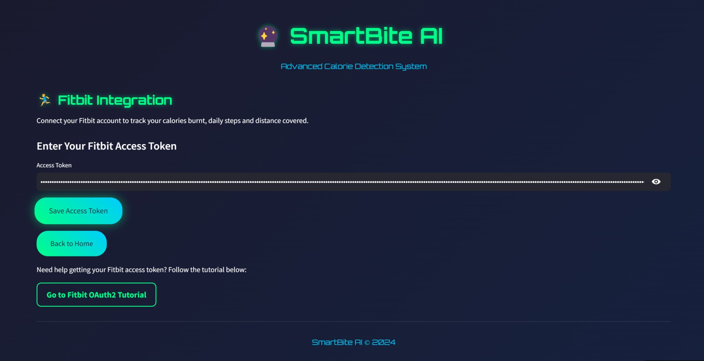
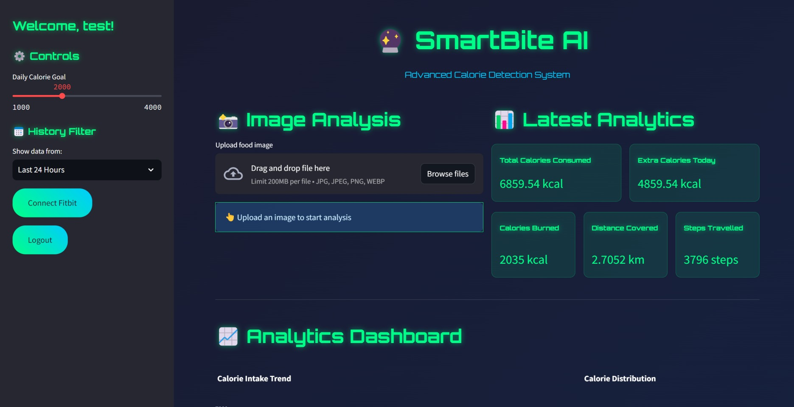

# 🍽️ SmartBite AI - Food Recognition & Calorie Estimation

## 📌 Project Overview
SmartBite AI is a machine learning-powered application that detects food from images and estimates calorie content, helping users track their nutritional intake. It provides user authentication, stores consumption history, and integrates real-time fitness data for a personalized experience. 

## 🚀 Features
✅ Food recognition using machine learning  
✅ Calorie estimation & nutritional analysis  
✅ User authentication & data storage  
✅ Live fitness data integration via API  
✅ Interactive dashboard with insights  

## 🏗️ Tech Stack
- **Programming Language**: Python  
- **Machine Learning**: TensorFlow, scikit-learn, NumPy  
- **Backend**: Python-based server  
- **Database**: User data storage & retrieval  
- **API Integration**: Fitness data from wearable devices  

## 📸 Screenshots
### Login Page :
    
### Food Detection with Calorie Estimation :
  
### Analytics Dashboard :
  
### Analysis History :
  
### Fitbit Access token :

### Fitbit Data Integration :
  


## 📖 Installation & Usage
```bash
# Clone the repository
git clone https://github.com/YOUR_GITHUB/SmartBite-AI.git
cd SmartBite-AI

# Install dependencies
pip install -r requirements.txt

# Run the application
python app.py
```

## 📝 Future Improvements
- 🏋️‍♂️ Advanced food classification models  
- 📊 More detailed nutritional breakdowns  
- 🔗 Additional wearable integrations  

## 🤝 Contributing
Contributions are welcome! Feel free to fork the repo and submit pull requests.

## ✉️ Contact
For any queries, reach out to **tharun151425@gmail.com** or visit my **[GitHub Profile](https://github.com/Tharun151425)**.
