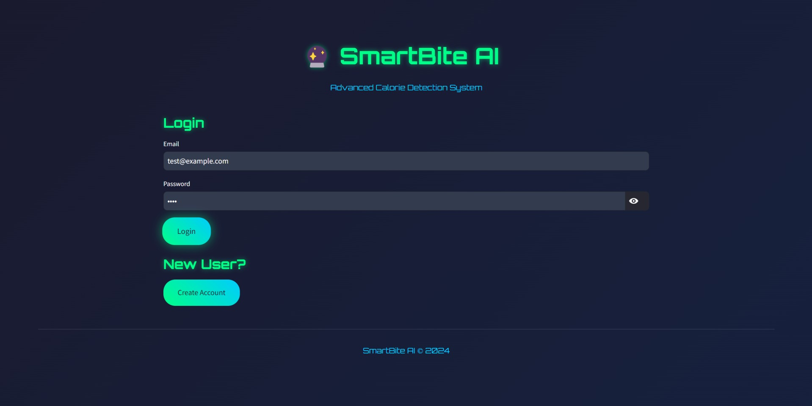
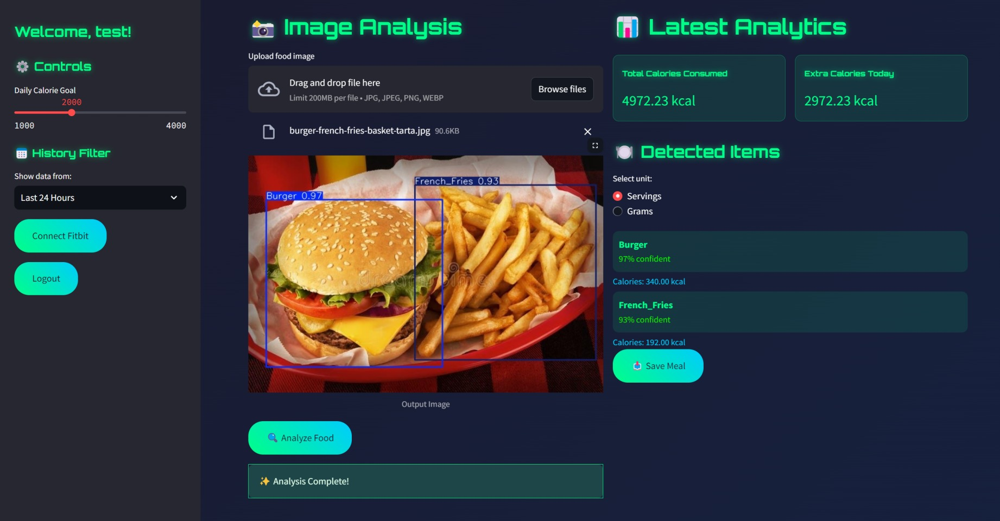
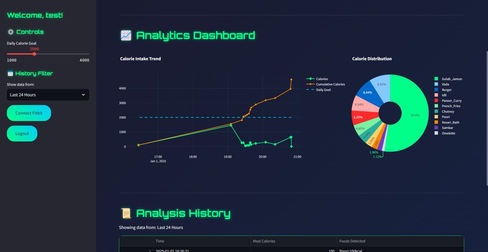
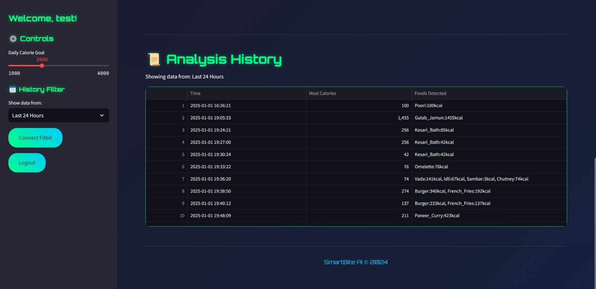
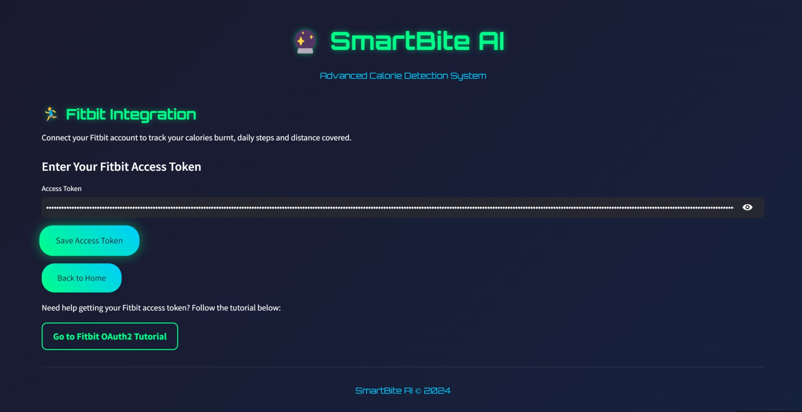
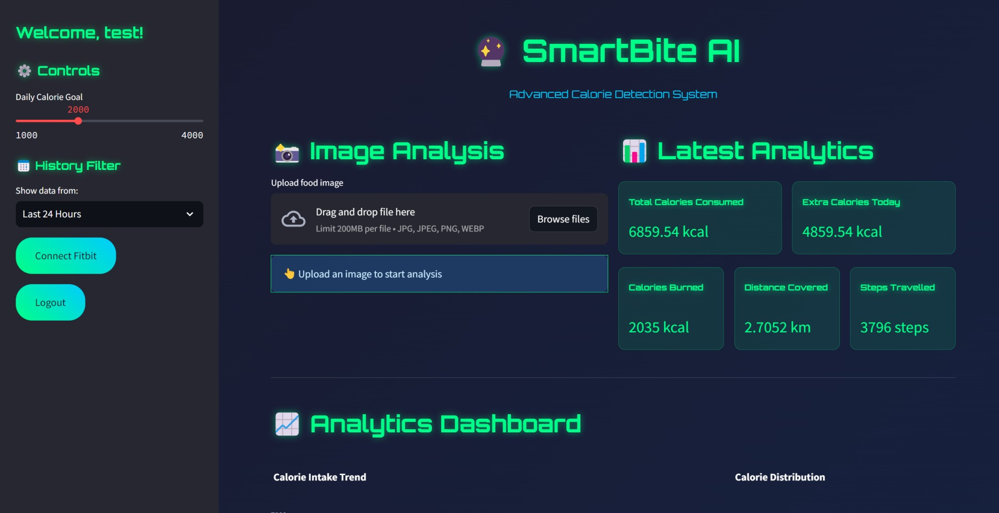

# 🍽️ SmartBite AI - Calorie Detection

[👉 Click here to check it out! 🍽️🚀](https://smartbiteai.streamlit.app/)  
🔗 GitHub Repo: [SmartBite-Calorie_Detection](https://github.com/Tharun151425/SmartBite-Calorie_Detection)

---

## 📌 Project Overview

**SmartBite AI** is an web app that combines calorie estimation using food recognition and fitness tracking to help users monitor their daily calorie intake and output. By using machine learning and real-time Fitbit integration, the platform offers personalized health insights — all in one place.

---

## 🚀 Features

✅ **Food Recognition** via AI (YOLOv8)  
✅ **Calorie Estimation** based on detected food  
✅ **User Authentication & History** using Supabase  
✅ **Fitbit Integration** to sync steps, calories burned & distance  
✅ **Daily Analytics Dashboard** with charts and trends  
✅ **Cloud-hosted & Real-time** updates  
✅ **Modular Codebase** for easy customization  

---

## 🏗️ Tech Stack

### 🧠 Machine Learning
- **YOLOv8** from Ultralytics for food detection
- **NumPy**, **OpenCV**, and **Pillow** for image processing

### 🖥️ Backend
- **Python** for API and logic
- **Supabase** for user authentication and real-time data storage
- **RESTful API** for Fitbit integration

### 📊 Dashboard & Frontend
- **Streamlit** for frontend and interactive visualization
- **Plotly**, **Pandas**, **Seaborn** for data visualization
- **extra-streamlit-components** for enhanced UI

### 🔗 API Integration
- **Fitbit Web API** to fetch:
  - Steps walked
  - Distance covered
  - Calories burned

---

## 📸 Screenshots
### Login Page :
    
### Food Detection with Calorie Estimation :
  
### Analytics Dashboard :
  
### Analysis History :
  
### Fitbit Access token :

### Fitbit Data Integration :
  


## 🛠️ Installation

### 1️⃣ Clone the Repository

```bash
git clone https://github.com/Tharun151425/SmartBite-Calorie_Detection.git
cd SmartBite-Calorie_Detection
```

### 2️⃣ Set Up Environment

Install all required dependencies (Python 3.10+ is recommended):

```bash
pip install -r requirements.txt
```

### 3️⃣ Configure Environment Variables

Create a `.env` file in the root directory and add your Supabase and Fitbit credentials:

```env
SUPABASE_URL=your_supabase_url
SUPABASE_KEY=your_anon_key
```

You may also need to configure your Fitbit app to redirect to your local or deployed URL and generate tokens manually for first-time setup.

### 4️⃣ Run the App Locally

Launch the Streamlit application:

```bash
streamlit run stream_ai.py
```

---

## 📦 Usage

1. **Log in or Sign up** to create a personal account.
2. **Upload a food image** using the interface.
3. The app will:
   - Run food detection on the image using YOLOv8
   - Estimate calorie content of the food
   - Log the meal and calories consumed to Supabase
4. The dashboard will fetch:
   - Your daily Fitbit data (steps, distance, calories burned)
   - Your daily calorie consumption
5. View visual insights in real-time through the interactive dashboard.
   
---
## 🤝 How to Contribute

We welcome contributions from developers, designers, and health enthusiasts alike!

### 🚀 Steps to Contribute:

1. **Fork** the repository

```bash
git clone https://github.com/Tharun151425/SmartBite-Calorie_Detection.git
```

2. **Create a new branch**

```bash
git checkout -b feature-name
```

3. **Make your changes** and commit

```bash
git add .
git commit -m "✨ Add new feature or fix"
```

4. **Push to your fork**

```bash
git push origin feature-name
```

5. **Open a Pull Request** on the main repository

We'll review it as soon as possible. Thank you for contributing! 🙌

---

### 💡 Tips for a Great Contribution:

- Follow the existing **code structure** and **naming conventions**
- Test your changes before submitting
- Add helpful **comments** and **docstrings**
- Include relevant screenshots or logs if applicable
- Keep PRs focused on one issue or feature at a time

---

## 📬 Contact

Feel free to reach out if you have any questions, ideas, or just want to connect!

- 👨‍💻 **Name**: Tharunkrishna M  
- 📧 **Email**: [tharunm1514@gmail.com](mailto:tharun151425@gmail.com)  
- 🐙 **GitHub**: [@Tharun151425](https://github.com/Tharun151425)  
- 💼 **LinkedIn**: [Tharunkrishna M](https://www.linkedin.com/in/tharunkrishna-m/)

---
Whether it's feedback, a collaboration idea, or just a hello — your message is always welcome!
